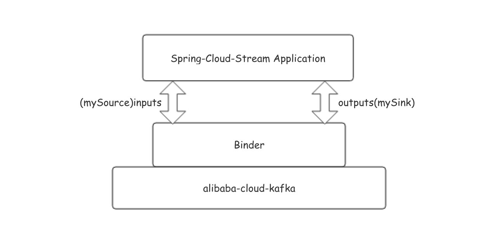

### 前言
以下为使用spring-cloud-stream和阿里云Kafka收发消息示例，其中示例分类为VPC内示例(内网)和公网SSL示例，可根据购买的实例信息选择相应示例运行。[Spring-Cloud-Stream文档](https://docs.spring.io/spring-cloud-stream/docs/current/reference/htmlsingle/#spring-cloud-stream-overview-introducing)
，更多配置可供参考构建健壮性和稳定性程序。

### 安装必备
1. Maven 3.2.5+
2. JDK 8+ 

### 示例简介
以Binder平台为阿里云kafka对示例进行简单的描述。示例例工程中通过Spring-Integration-Poller发送消息到Kafka，然后通过Listener监听从Kafka收取消息。


 
1. 示例中mySource即测试的输入源定义，同时需要在配置文件中定义destination和数据格式
2. 示例中mySink即测试的输出源定义，同时需要在配置文件中定义group、destination和数据格式

### 示例配置

#### VPC内示例配置

将application.properties中的"XXX"替换为实际值

```
kafka.bootstrap-servers=XXX
kafka.consumer.group=XXX
kafka.topic.name=XXX
```
#### SSL示例配置

1. 修改application.properties中的"XXX"替换为实际值

```
kafka.bootstrap-servers=XXX
kafka.consumer.group=XXX
kafka.topic.name=XXX
kafka.ssl.truststore.location=/XXX/kafka.client.truststore.jks
```

2. 修改kafka_client_jaas.conf中的username和password，可从实例详情获取。

```
KafkaClient {
  org.apache.kafka.common.security.plain.PlainLoginModule required
  username="XXX"
  password="XXX";
};

```

### 示例运行
在相应示例目录下执行
sh run_demo.sh 